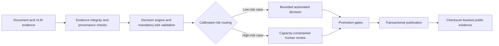
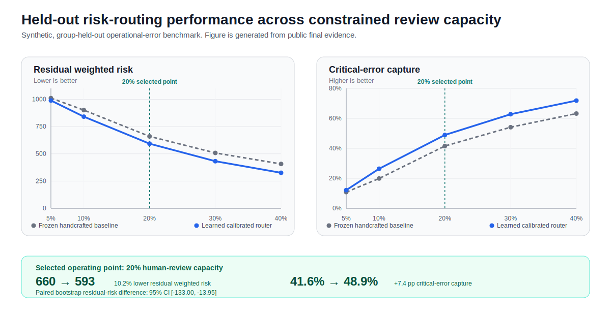

# Risk-Controlled VLM Evidence Platform

<!-- README_BADGES_START -->
[](https://github.com/ReviveCoding/risk-controlled-vlm-evidence-platform/actions/workflows/ci.yml)
[](https://github.com/ReviveCoding/risk-controlled-vlm-evidence-platform/actions/workflows/codeql.yml)
<!-- README_BADGES_END -->

Version: 0.7.1

A reliability-first platform for converting document and VLM evidence into risk-aware automated decisions. The system validates evidence integrity, estimates operational risk, routes high-risk cases to constrained human review, and publishes auditable experiment artifacts.

## Core Capabilities

- Validates source-grounded evidence, mandatory decision slots, provenance, and unsafe or invalid decision states.
- Compares a frozen handcrafted risk baseline with a learned calibrated risk-routing policy.
- Routes high-risk cases under explicit human-review capacity constraints.
- Applies predefined promotion gates for ranking quality, calibration, residual risk, critical-error capture, false-greenlight behavior, review budget, latency, and bootstrap uncertainty.
- Publishes transactional run artifacts with checksum-based manifest validation.
- Includes Windows-specific publication-lock and PID-liveness portability regression coverage.

<!-- README_VISUALS_START -->
## System Architecture



## Risk-Routing Performance Across Review Capacity



The SVG is generated deterministically from
[`baseline_metrics.json`](reports/final_run/baseline_metrics.json),
[`candidate_metrics.json`](reports/final_run/candidate_metrics.json), and
[`public_evidence_summary.json`](reports/final_run/public_evidence_summary.json).
<!-- README_VISUALS_END -->

## Held-Out Evaluation

The final experiment used a synthetic, group-held-out operational-error benchmark with 3,600 training cases, 1,080 calibration cases, and 1,080 held-out evaluation cases.

At a 20% human-review capacity:

| Metric | Frozen Handcrafted Baseline | Learned Calibrated Router |
|---|---:|---:|
| AUROC | 0.7544 | 0.7867 |
| PR-AUC | 0.5890 | 0.6452 |
| Brier score, lower is better | 0.1820 | 0.1700 |
| ECE-10, lower is better | 0.0455 | 0.0379 |
| Residual weighted risk, lower is better | 660 | 593 |
| Critical-error capture | 41.6% | 48.9% |
| Single-case p95 routing latency | 0.05 ms | 1.87 ms |

The learned router reduced held-out residual weighted risk by 10.2% and increased critical-error capture by 7.4 percentage points. The paired bootstrap estimate of the residual-risk difference was -74.8 with a 95% confidence interval of [-133.0, -13.95].

## Run Local Qualification

```powershell
powershell -NoProfile -ExecutionPolicy Bypass -File .\RUN_LEARNED_RISK_ROUTING.ps1
```

The qualification workflow runs static checks, type checks, tests, the held-out routing experiment, promotion gates, and artifact validation.

## Final Evidence

Public-safe final evidence is available in `reports/final_run/`:

- `public_evidence_summary.json`
- `baseline_metrics.json`
- `candidate_metrics.json`
- `per_group_metrics.json`
- `feature_schema.json`
- `experiment_config.json`
- `promotion_gate.json`
- `model_card.md`
- `SHA256SUMS.txt`

Raw model binaries and held-out prediction records are intentionally excluded from the public repository.

## Verification Status

- Ruff lint and formatting checks: PASS
- Mypy: PASS
- Pytest: 135 passed, 1 skipped
- Windows local qualification pipeline: PASS
- Final artifact validation: PASS
- Promotion decision: `PROMOTE_LEARNED_ROUTER`

## Scope and Claim Boundary

The results demonstrate improved risk-routing allocation against a frozen handcrafted baseline on a synthetic group-held-out operational-error benchmark. They do not claim improved real-world VLM accuracy, production deployment, or customer-facing impact.
